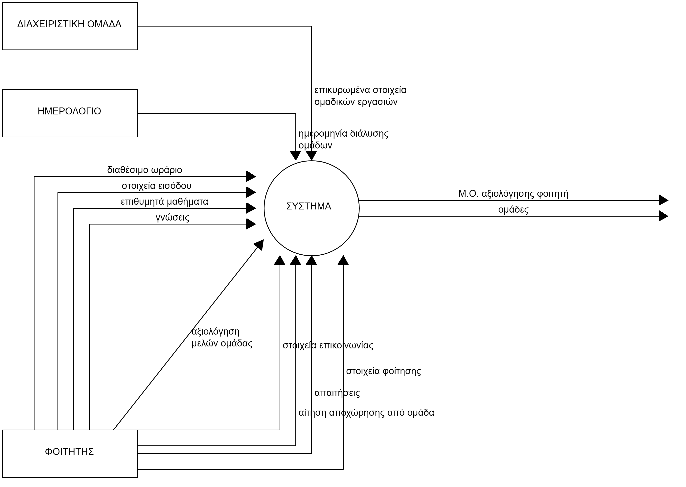
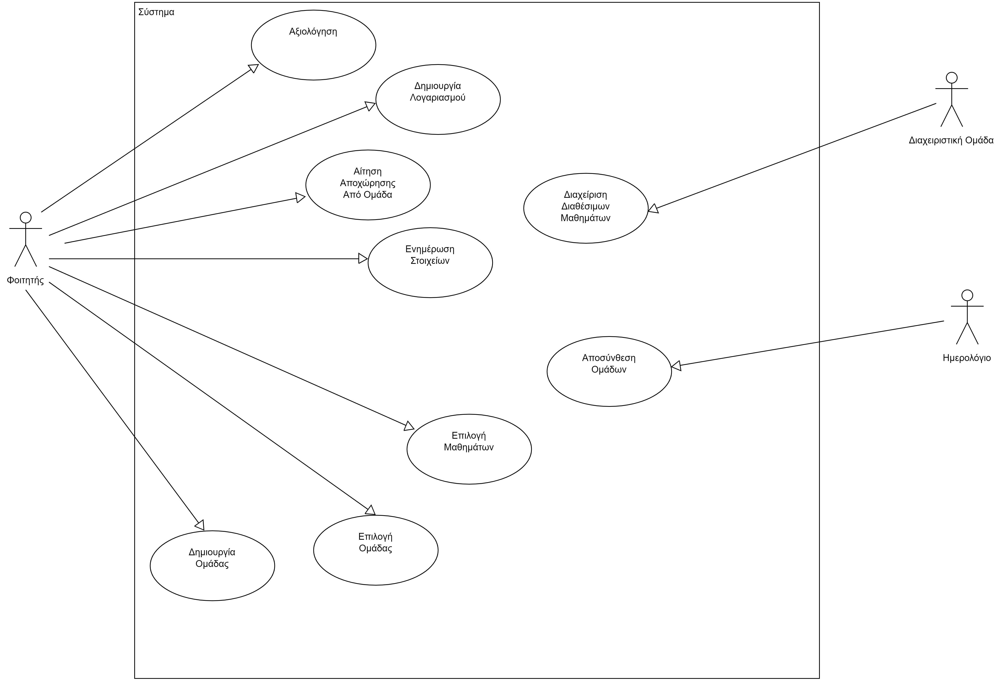
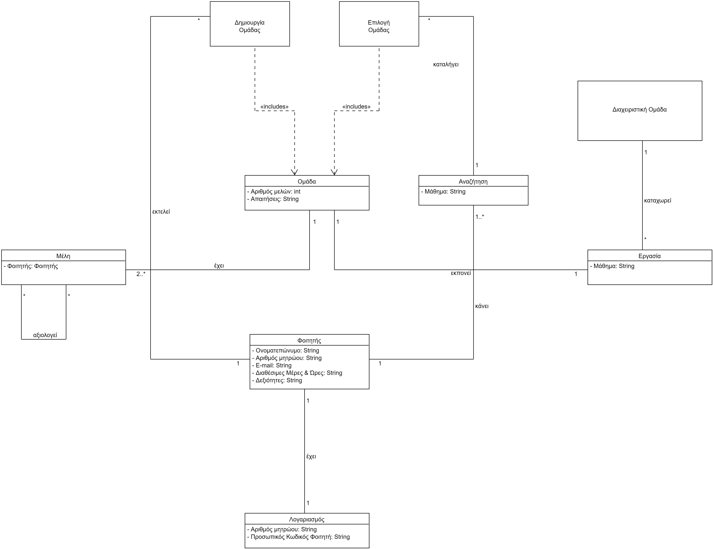
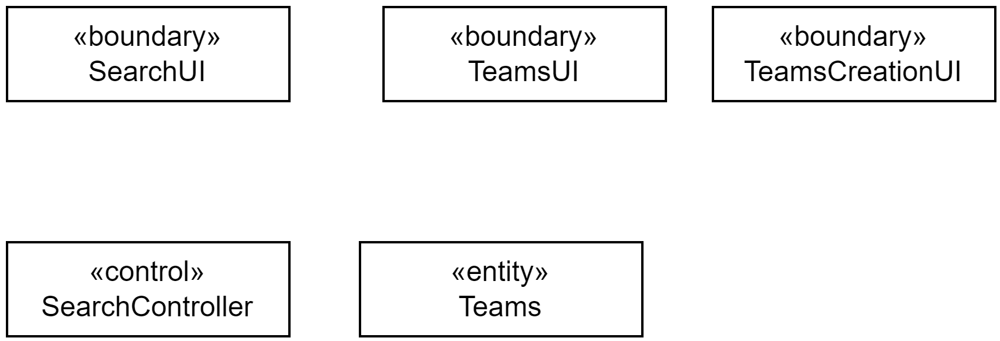
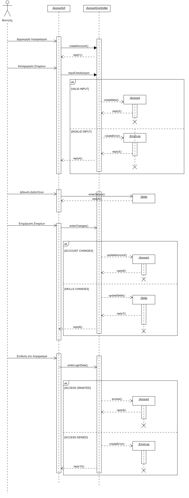
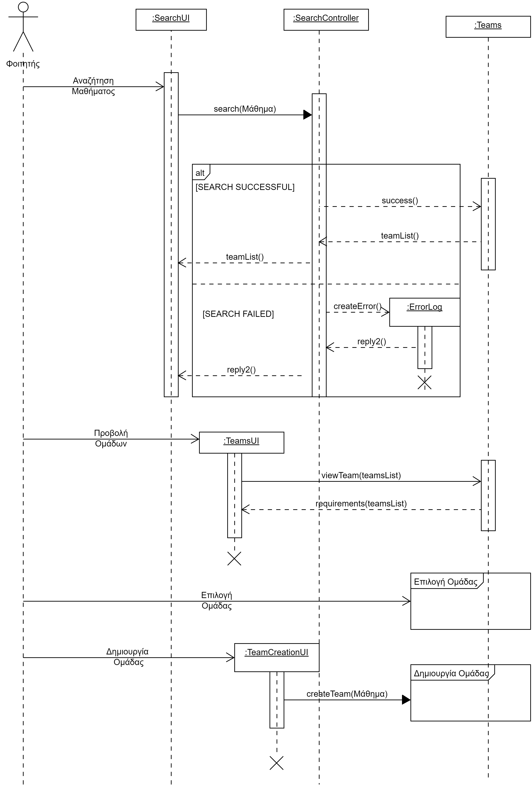

# Εισαγωγή

Ο σκοπός αυτού του έγγραφου είναι να περιγράψει το πεδίο ορισμού, τις απαιτήσεις λογισμικού και την ανάλυση του συστήματος της εφαρμογής Project Partners.

### Εμβέλεια

#### Δυνατότητες Λογισμικού
Αρχικά, το λογισμικό επιτρέπει στους διαχειριστές να προσθέσουν μαθήματα που έχουν ομαδικές εργασίες. Επίσης, θα δημιουργεί τον λογαριασμό του φοιτητή, με βάση τον αριθμό μητρώου του και θα αποθηκεύει τα στοιχεία του. Το σύστημα θα επιτρέπει στον φοιτητή να ενημερώσει τα στοιχεία αυτά όποτε επιθυμεί, με την προϋπόθεση να υποβάλλει τον κωδικό του. Έπειτα το σύστημα του παρουσιάζει τα μαθήματα της σχολής, που απαιτούν την εκπόνηση μίας ομαδικής εργασίας φιλτραρισμένα ανά εξάμηνο. Ο φοιτητής επιλέγει τα μαθήματα στα οποία αναζητεί ομάδα, το σύστημα αποθηκεύει τις επιλογές του και ύστερα του εμφανίζει τις διαθέσιμες ομάδες ανά μάθημα. Στη συνέχεια εάν διαλέξει μία από τις διαθέσιμες ομάδες, το σύστημα ειδοποιεί τον υπεύθυνο εκείνης της ομάδας και περιμένει έγκριση από αυτόν, για να πραγματοποιηθεί η εγγραφή του φοιτητή σε αυτή την ομάδα. Ωστόσο, εάν δεν επιλέξει καμία από τις διαθέσιμες ομάδες, το σύστημα του δίνει τη δυνατότητα να δημιουργήσει μία δική του, θέτοντας ένα όριο στον δυνατό αριθμό μελών, στην οποία θα ορίσει αυτός τις δικές του απαιτήσεις. Επιπλέον, ο φοιτητής έχει τη δυνατότητα να αποχωρήσει από μία ομάδα στην οποία εγγράφηκε στο παρελθόν. Μετά την ολοκλήρωση του εξαμήνου, το σύστημα θα δέχεται ανώνυμες αξιολογήσεις μεταξύ των φοιτητών που συνεργάστηκαν και αποσυνθέτει τις ομάδες.

#### Λειτουργίες εκτός των δυνατοτήτων του λογισμικού
Το λογισμικό δεν επιτρέπει να συνδεθεί ο χρήστης χωρίς να έχει αριθμό μητρώου, δεν δίνει πρόσβαση στον χρήστη χωρίς σωστή υποβολή του κωδικού του, δεν επιτρέπει να φτιάξει ο χρήστης πάνω από μια ομάδες στο ίδιο μάθημα, δεν αφήνει το χρήστη να αξιολογήσει κάποιο συμφοιτητή του αν δεν έχει συνεργαστεί μαζί του τουλάχιστον μία φορά, δεν δίνει τη δυνατότητα στον φοιτητή να δει τα στοιχεία επικοινωνίας των ατόμων που δεν είναι στην ομάδα του, δεν αφήνει τον χρήστη να ενημερώσει τα στοιχεία του εάν δεν υποβάλλει τον κωδικό του για λόγους εξακρίβωσης, δεν επιτρέπει μία ομάδα να υπερβεί το μέγιστο αριθμό μελών.

## Data Flow Diagram

### Ακρώνυμα και Συντομογραφίες

|  Έννοια  |   Επεξήγηση     |
|----------------------|----------------------------------|
| Αριθμός Μητρώου                | Ο μοναδικός αριθμός που δίνεται σε κάθε φοιτητή κατά την εγγραφή της σχολής |
| Φοιτητής| Ο μαθητής που σπουδάζει και φοιτά στο πανεπιστήμιο|
| Ημερολόγιο| Σύστημα που αναγράφει όλες τις ημέρες του έτους|
| Διαχειριστική Ομάδα| Η ομάδα που είναι υπεύθυνη για τη διαχείρηση ενός συστήματος|

### Επισκόπηση

Στη συνέχεια θα παρουσιαστεί μία γενική εικόνα του συστήματος με τη χρήση ενός μοντέλου περιπτώσεων χρήσης. Έπειτα θα ακολουθήσουν οι απαιτήσεις του λογισμικού αλλά και η ανάλυση του συστήματος.

## Μοντέλο Περιπτώσεων Χρήσης

| Περιπτώσεις χρήσης  |   Ανάλυση Περιπτώσεων Χρήσης     |
|-------------------- |----------------------------------|
|[**ΠΧ1 Διαχείριση Εργασιών**](docs/markdown/project_management.md)| Η διαχειριστική ομάδα οργανώνει τις διαθέσιμες ομαδικές εργασίες του τρέχοντος εξαμήνου|
|[**ΠΧ2 Διαχείριση Λογαριασμού**](docs/markdown/account_management.md)| Ο φοιτητής διαχειρίζεται το λογαριασμό του και τα στοιχεία του|
|[**ΠΧ3 Αναζήτηση Ομάδας**](docs/markdown/research_of_team.md)| Ο φοιτητής ψάχνει ομάδα|
|[**ΠΧ4 Συμμετοχή Σε Ομάδα**](docs/markdown/team_participation.md)| Ο φοιτητής επιλέγει μία υπάρχουσα ομάδα |
|[**ΠΧ5 Δημιουργία Ομάδας**](docs/markdown/team_creation.md)| Ο φοιτητής δημιουργεί μία δική του ομάδα αντί να εγγραφεί σε μία υπάρχουσα|
|[**ΠΧ6 Αίτηση Αποχώρησης Από Ομάδα**](docs/markdown/leave_request.md)| Ο φοιτητής αιτείται να αποχωρήσει από μία ομάδα που είναι εγγεγραμμένος|
|[**ΠΧ7 Αξιολόγηση Μέλους Ομάδας**](docs/markdown/team_member_evaluation.md)| Ο φοιτητής αξιολογεί κάποιο συμφοιτητή του με τον οποίο συνεργάστηκε|
|[**ΠΧ8 Διαχείριση Αιτημάτων Συμμετοχής**](docs/markdown/participation_requests_management.md)|Ο φοιτητής που έχει δημιουργήσει μία ομάδα, διαχειρίζεται τα αιτήματα συμμετοχής από συμφοιτητές|

## Συμπληρωματικές προδιαγραφές

*Οι επόμενες ενότητες περιέχουν όλες τις μη λειτουργικές απαιτήσεις και τους περιορισμούς σχεδίασης και υλοποίησης.*

### Απαιτήσεις διεπαφών

#### Διεπαφές χρήστη

Όλες οι διεπαφές χρήστη θα είναι διαδικτυακές.

#### Διεπαφές υλικού

Το σύστημα θα λαμβάνει κωδικούς από το πληκτρολόγιο του φοιτητή-χρήστη.

#### Διεπαφές επικοινωνίας

Το σύστημα θα στέλνει ενημερωτικά ηλεκτρονικά μηνύματα για τα αιτήματα του φοιτητή.

### Περιορισμοί σχεδίασης και υλοποίησης

#### Βάσεις Δεδομένων

Το σύστημα θα πρέπει να υποστηρίζει τα σχεσιακά συστήματα διαχείρισης βάσεων δεδομένων MySQL και PostgreSQL.
#### Java
Το σύστημα θα αναπτυχθεί σε Java.   
Το σύστημα θα μπορεί να εκτελείται σε εικονικές μηχανές της Java από την έκδοση 5.0 ή νεότερη.

### Ποιοτικά χαρακτηριστικά

#### Απόδοση

Το σύστημα θα πρέπει να υποστηρίζει όλο το τμήμα της σχολής το οποίο μπορεί να φτάσει τους 1500 χρήστες.
Η απόκριση της βάσης δεδομένων σε κάθε δοσοληψία δεν πρέπει να ξεπερνά τα 5 δευτερόλεπτα.

#### Διαθεσιμότητα

Το σύστημα θα είναι διαθέσιμο καθημερινά
Οι λειτουργία της αναζήτησης ομάδας θα λειτουργεί κάθε μέρα και κάθε ώρα της εβδομάδας.

#### Ασφάλεια

Οι λειτουργίες αναζήτησης θα είναι διαθέσιμες μόνο για τους φοιτητές που είναι εγγεγραμμένοι στην εφαρμογή.

#### Ευελιξία

Ενδεχόμενη προσαρμογή του συστήματος σε ένα νέο σύστημα διαχείρισης βάσεων δεδομένων δεν θα πρέπει να ξεπερνά τις 20 ημέρες.

#### Ευχρηστία

Η μόνη προϋπόθεση για τον τελικό χρήστη είναι να γνωρίζει τη χρήση των web browsers.

# Υποστηρικτικό υλικό

## Μοντέλο πεδίου

## Ανάλυση περιπτώσεων χρήσης

### Κλάσεις ανάλυσης

## Διαγράμματα Ροής

### Διάγραμμα Ροής Διαχείρισης Λογαριασμού

### Διάγραμμα Ροής Αναζήτησης Ομάδας 

